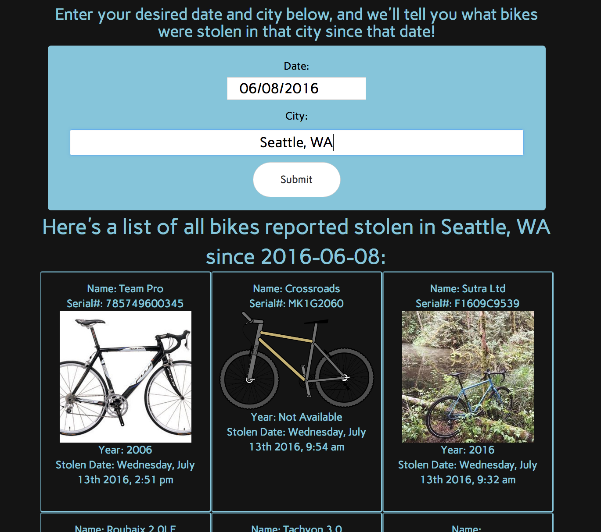

# _Bike-Index_

#### _A JavaScript webapp that uses the CORs-compliant API from Bike Index to retreive data from a bike database._ 

#### By _**Adam Craig**_

## Description

_A JavaScript webapp that utilizes the Bike Index API so that users can perform searches for stolen bikes, filtering by the city the theft occurred and after what date._

## Setup/Installation Requirements

* _Ensure that node.js, NPM, and Bower are installed on your machine._
* _Using the command line, clone the bike-index repository to your desktop using the command "git clone https://github.com/AdamCraig/bike-index"_
* _In the command line, navigate to the bike-index folder and install dependencies using the commands "npm install" and "bower install"._
* _After dependencies have finished loading/installing, run the command "gulp build"._
* _After the build task has completed, the index.html file can be opened in an internet browser to begin using the application._

## Known Bugs

_No known bugs at this time._

## Support and contact details

_For all issues and support, please contact:
Adam Craig at ajcraig@suffolk.edu_

## Technologies Used

_HTML, CSS, SASS, JavaScript, jQuery, AJAX, node.js, NPM, Bower, Gulp_

### License

The MIT License (MIT)

Copyright (c) 2016 Adam Craig and Luca Quatela

Permission is hereby granted, free of charge, to any person obtaining a copy
of this software and associated documentation files (the "Software"), to deal
in the Software without restriction, including without limitation the rights
to use, copy, modify, merge, publish, distribute, sublicense, and/or sell
copies of the Software, and to permit persons to whom the Software is
furnished to do so, subject to the following conditions:

The above copyright notice and this permission notice shall be included in all
copies or substantial portions of the Software.

THE SOFTWARE IS PROVIDED "AS IS", WITHOUT WARRANTY OF ANY KIND, EXPRESS OR
IMPLIED, INCLUDING BUT NOT LIMITED TO THE WARRANTIES OF MERCHANTABILITY,
FITNESS FOR A PARTICULAR PURPOSE AND NONINFRINGEMENT. IN NO EVENT SHALL THE
AUTHORS OR COPYRIGHT HOLDERS BE LIABLE FOR ANY CLAIM, DAMAGES OR OTHER
LIABILITY, WHETHER IN AN ACTION OF CONTRACT, TORT OR OTHERWISE, ARISING FROM,
OUT OF OR IN CONNECTION WITH THE SOFTWARE OR THE USE OR OTHER DEALINGS IN THE
SOFTWARE.
